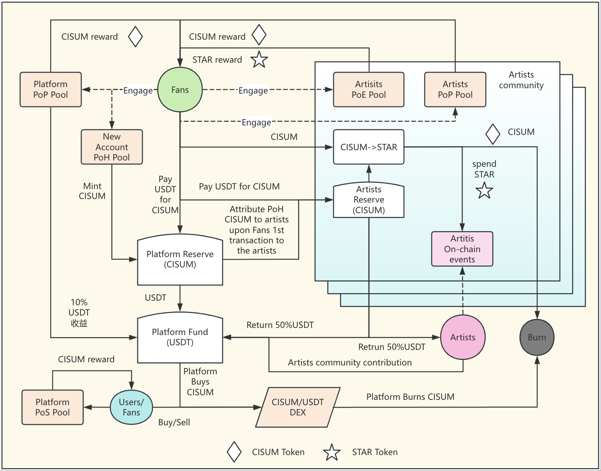

以下是將您提供的白皮書內容翻譯成中文繁體字的版本，保持原文結構和專業語氣，適合用於正式的白皮書文件：

---

`Cisum Verse 白皮書`

# Cisum Verse
**以 Web3 革新音樂與藝術產業**

# 引言

音樂與藝術是人類文明的基石，然而，該產業長期以來面臨根植於傳統及 Web2 結構的挑戰：

- **集中化**：數據和資產由集中化平台控制，導致權力集中、操控及創作者與粉絲的高額費用。
- **缺乏透明度**：不透明的數據流動及對資產所有權和價值增長資訊的限制，常常損害用戶和創作者的利益。
- **效率低下**：Web2 架構設下過多障礙，阻礙付款、結算及藝術家與觀眾的全球觸達。
- **價值分配不公**：主要中介機構以犧牲創作者和粉絲為代價最大化其利潤，抑制了產業的創新與可持續性。

# 願景

在 Cisum Verse，我們設想一個無邊界、透明且公平的音樂與藝術生態系統，由 Web3 技術驅動。通過區塊鏈、智慧合約和去中心化治理，我們賦能藝術家及其社群，促進一個可持續、充滿活力且協作的未來。

Cisum Verse 是一個開創性的平台，致力於將新興藝術家轉化為全球明星。通過 Web3 技術，我們將音樂藝術家與其不斷擴大的粉絲群連結起來，實現真實的互動和共享成功。

# 解決方案

Cisum Verse 利用 Web3 和人工智能技術，通過以下關鍵方式賦能年輕藝術家實現成為明星的夢想：

1. **發行鏈上代幣**

| 代幣       | 類型 | 使用/權益/收益                     | 獲取方式                     |
|------------|------|------------------------------------|-----------------------------|
| `CISUM`    | FT   | 平台級代幣，用於激勵生態系統貢獻者和支持者 | 通過私募或去中心化/中心化交易所 |
| `CVSBT`    | NFT  | 靈魂綁定代幣，用於衡量持有者的總體貢獻 | 通過在平台及生態系統內消費獲得 |
| `GRAB`     | NFT  | 用於在平台組織的搶票活動中獲取免費門票 | 通過帳戶註冊或邀請他人鏈上註冊 |
| `STAR NFTs`| NFT  | 用作在服務/內容/產品消費的信用點數，每個藝術家社群獨有 | 通過燃燒 CISUM 鑄造或參與 `PoE` 活動 |
| `Badge NFTs`| NFT  | 以 `普通`/`銀級`/`金級`/`白金` 等徽章類型表示會員等級 | 當 `CVSBT` 數量達到指定水平時可領取 |
| `Ticket NFTs`| NFT | 每場演出擁有獨特的門票 NFT 集合 | 通過搶票活動或直接購買獲得 |

> [!NOTE]
> 除了潛在的金融價值增值外，CISUM 代幣持有者可獲得治理權，通過 Cisum 基金會組織的投票流程參與平台範圍的決策。
> CISUM 的最終目標是成為音樂與藝術產業的結算媒介，並將音樂/藝術粉絲從消費者轉變為股東、製作人和 DAO 治理者。

2. **進行挖礦活動**

| 挖礦類型             | 描述                                                         |
|-----------------------|-------------------------------------------------------------|
| `PoH`：頭部證明      | 每個新帳戶註冊將新鑄造價值 `$20` 的 `CISUM` 代幣           |
| `PoE`：參與證明      | 參與藝術家或項目互動活動以挖掘 `STAR` 代幣                   |
| `PoP`：支付證明      | 付款者將獲得相當於支付金額 `10%` 的新鑄造 `CISUM` 代幣      |
| `PoS`：質押證明      | `CISUM` 代幣質押者將根據選定的鎖定期間獲得固定年化收益率的利息獎勵，獎勵為新鑄造的 `CISUM` 代幣 |

> [!NOTE]
> 範例 PoE 活動包括但不限於以下內容：
>  - 每日簽到藝術家社群
>  - 邀請他人加入藝術家社群
>  - 在社交媒體上發布/分享藝術家活動
>  - 播放藝術家音樂
>  - 與他人分享藝術家音樂
>  - 購買藝術家相關產品

# 生態系統整體架構

以下展示了藝術家、粉絲與平台之間的互動流程高階圖表，展示各種挖礦機制：

<h4 align="center" style="color:grey;font-weight: normal;">圖表-1：CISUM 生態系統架構圖</h4>

> [!NOTE]
> 1. 隨著平台擴展至全球市場，可建立任意數量的藝術家社群。
> 2. 每個藝術家社群需將其平台收入的 10% 作為對平台基金的貢獻。
> 3. 平台需使用平台基金回購並燃燒 CISUM 代幣，以創造持續的通縮效應。

## 代幣分配

`CISUM` 總供應量為 `100 億`，其中 `55%` 需通過生態系統活動挖掘。以下圖表顯示平台代幣的整體分配。

<h4 align="center" style="color:grey;font-weight: normal;">圖表-2：CISUM 代幣分配圖</h4>

# CISUM 代幣分配計劃

| 分配類別           | 百分比 | 代幣數量             | 歸屬計劃                     | 描述                             |
|--------------------|--------|----------------------|-----------------------------|---------------------------------|
| 創始團隊           | 15%    | 15億 CISUM           | 18個月鎖定期，36個月線性解鎖 | 為創始成員保留，遵循歸屬計劃以確保長期一致性。 |
| 私募融資           | 15%    | 12億 CISUM           | 18個月鎖定期，18個月線性解鎖 | 分配給私募早期投資者，設有歸屬期以防止市場拋售。 |
| 基金會             | 8%     | 8億 CISUM            | 無                          | 用於平台開發、研究及基金會治理的社群活動。     |
| 戰略儲備           | 4%     | 4億 CISUM            | 無                          | 為未預見的機會及平台穩定措施保留。             |
| 社群空投           | 3%     | 3億 CISUM            | 無                          | 分發給早期用戶及社群成員以促進平台採用和參與。 |
| 生態系統挖礦       | 55%    | 50億 CISUM           | 無                          | 通過頭部、支付及質押證明挖掘，以激勵參與及生態發展。 |

## CISUM 代幣流通計劃

<h4 align="center" style="color:grey;font-weight: normal;">圖表-3：CISUM 流通計劃圖</h4>

# 技術

## 區塊鏈與智慧合約技術的應用

Cisum Verse 選擇 [FullOn Network](https://fullon.network) 作為其應用平台，這是一個高效能的 Layer-1 公開區塊鏈，具有以下優勢：
  - **極低手續費**：交易成本低於 $0.0001，確保可負擔性。
  - **高效能**：支持每秒 10,000 次交易，架構可擴展至每秒 100 萬次交易。
  - **低延遲**：實現 0.5 秒區塊間隔和 1 秒最終確認，確保快速交易處理。
  - **互操作性**：以安全高效的方式與其他區塊鏈無縫連接。

此外，FullOn Network 支持 EVM 和 WASM 智慧合約技術，使 Cisum Verse 能夠實現高度去中心化的解決方案，滿足其特定需求。

## 人工智能技術的應用

Cisum Verse 將與人工智能技術提供商合作，為藝術家開發虛擬內容和自主化身/代理，並創建一個用於音樂會的虛擬自主空間，接待全球觀眾。

# 團隊

## 創始合作夥伴

- **STAR NEST**：亞洲音樂推廣與交易平台，由 Zorror Xu 創立。
- **ZENITH Entertainment Group**：K-pop 先驅，前 SM 娛樂 CEO，培養超過 10 個頂尖 K-pop 團體，粉絲群超過 5,000 萬。
- **INQ**：越南最大的獨立音樂公司，簽約 7 位藝術家，擁有超過 1,000 萬粉絲。
- **About Capitale Management**：專注於私募股權投資，擁有 Huobi 全球交易所，提供亞太市場的資產管理服務。

## 策略合作夥伴

- **United Entertainment Group**：騰訊音樂娛樂集團旗下品牌，負責藝術家、音樂會及音樂節投資管理。
- **Kazakhstan OZEN XO LLP**：中亞最大的版權交易平台，為超過 600 位獨立音樂家分發作品。
- **CAPITAL Theater**：越南知名獨立音樂場地，容量 2,000 人，每年舉辦超過 100 場演出，吸引超過 10 萬名觀眾。
- **香港 SATELITE 電子音樂品牌**：由 Lane Crawford 集團共同創始人 Janva Tam（譚樹中）創立，為 LVMH 組織超過 100 場全球活動。SATELITE 每年舉辦超過 100 場電子音樂派對，粉絲會員超過 10 萬。
- **FullOn Blockchain**：Cisum Verse 的技術基礎，支持鏈上發行、流通和交易 Cisum Verse 代幣，並通過一系列治理智慧合約實現代幣經濟學。

## 領導團隊

- **Dow**：策略與財務，金融投資專家。
- **Zorro**：藝術家發掘與內容策劃，前華納唱片區域總裁。
- **Jun Kang**：藝術家培訓與版權推廣，前 SM 娛樂 CEO。
- **Michael Choi**：藝術家發展與版權製作，知名英國音樂製作人。
- **Thor**：技術架構，FullOn 區塊鏈創始人。

# 治理模式

- **初始治理（2025-2028）**：Cisum 基金會（註冊於開曼群島）負責監督策略規劃、代幣發行及生態系統管理，確保合規性和初期穩定。
- **過渡治理（2028-2029）**：逐步轉向去中心化治理，由粉絲 DAO 主導，粉絲通過 CISUM 質押和徽章系統參與決策。
- **完全去中心化治理（2029年起）**：粉絲 DAO 完全接管，粉絲與藝術家共同決定平台發展、藝術家簽約及收入分配，建立真正的社群共治生態系統。

> [!TIP]
> 本白皮書中呈現的所有參數值均需接受未來 DAO 治理的調整，以適應動態變化的市場環境。

# 結論：與 CISUM 共創音樂未來

CISUM 代表音樂產業未來的變革願景。通過技術創新和社群治理，我們致力於構建一個公平、透明、可持續的生態系統，將全球音樂推向 Web3 時代。加入我們，一起塑造音樂的未來。