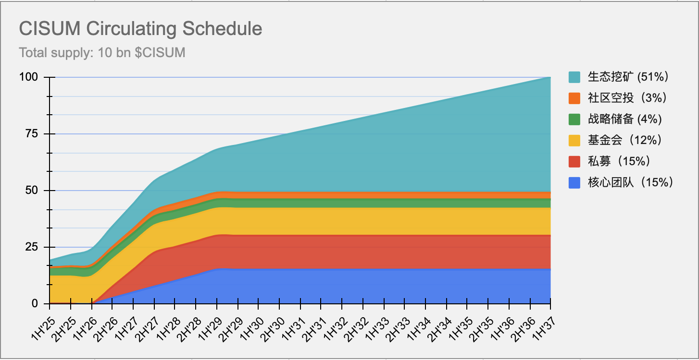

`Cisumverse 白皮書`

# Cisumverse
**以 Web3 和 A.I. 技术革新音樂與藝術產業**

# 摘要

`Cisumverse`是全球首个专注于音乐艺人全生命周期孵化的 Web3 平台，构建在高性能 FullOn 公链之上，并发行了实用型生态应用代币`CISUM`和其它一系列的辅助通证。`Cisumverse`通过创新的四阶段艺人孵化模式、多元化挖矿机制和双代币经济系统，为全球音乐生态参与者提供功能性价值交换工具，推动音乐产业向去中心化、社区驱动的方向发展。作为`Cisumverse`平台的原生代币，`CISUM`融合 Web3 和 A.I.技术，构建一个透明、公平的音乐经济生态，助力新兴艺术家成为全球明星，并将粉丝从消费者转变为投资者和股东。

> [!NOTE]
> 重要声明: `CISUM`是实用型代币（Utility Token），专门用于生态系统内的功能性应用和服务支付，不代表任何公司股权
> 、债权或投资合约，不具有证券属性。 

# 1. 引言

## 1.1 音乐产业的结构性挑战
传统音乐产业长期面临价值分配不均、中介成本高昂、艺术家收益微薄等结构性问题。现有 Web3 音乐平台虽然引入了去中心化概念，但普遍存在以下痛点：

- `过度强调去中心化`：忽略了艺术家归属感和粉丝粘性这两个音乐产业的核心要素

- `商业模式单一`：主要依赖NFT投机，缺乏可持续的收益模式
- `用户体验差`：技术门槛高，普通用户难以参与
- `代币价值支撑不足`：缺乏实际使用场景和价值锚定

## 1.2 Cisumverse的解决方案

`Cisumverse`通过四阶段艺人孵化模式，融合Web2成功经验与Web3技术创新，解决了传统Web3音乐平台的核心痛点。`Cisumverse`作为全球首创的专注重音乐艺人全生命周期孵化的Web3平台（Cisumverse Artist Incubation Platform, CAIP），结合A.I.分析、NFT发行和粉丝投资机制，提供从艺人发掘到元宇宙扩展的全流程支持：

- `重建艺人归属感`：通过签约艺人模式，建立平台与艺人的深度绑定关系;
- `增强粉丝粘性`：通过多元化互动和收益分享，提升粉丝对平台的忠诚度;
- `多元化收益模式`：整合订阅、广告、周边、演出等多种收入来源;
- `实用价值支撑`：基于实际收入的`10%`绑定机制，确保代币价值有实际支撑;

核心流程包括艺人发掘（Web2选拔与A.I.分析）、培养（培训与粉丝互动）、推广（全球巡演与品牌合作）、变现（NFT发行与元宇宙体验）。

## 1.3 Cisumverse的三大核心策略

**Cisumverse**利用 Web3 和 AI 技术，通过三大核心策略赋能年轻艺术家实现明星梦想：

1. **万物代币化**

| 代幣       | 類型 | 使用/權益/收益                     | 獲取方式                     |
|------------|------|------------------------------------|-----------------------------|
| `CISUM`    | FT   | 平台級代幣，用於激勵生態系統貢獻者和支持者 | 通過私募或去中心化/中心化交易所 |
| `GRAB`     | NFT  | 用於在平台組織的搶票活動中獲取免費門票 | 通過帳戶註冊或邀請他人鏈上註冊 |
| `NESTAR`   | NFT  | 用作在服務/內容/產品消費的信用點數，每個藝術家社群獨有 | 通過燃燒 CISUM 鑄造或參與 `PoE` 活動 |
| `Badge NFTs`| NFT  | 以 `普通`/`銀級`/`金級`/`白金` 等徽章類型表示會員等級 | 當消耗的 `NESTAR` 數量達到指定水平時可領取 |
| `Ticket NFTs`| NFT | 每場演出擁有獨特的門票 NFT 集合 | 通過搶票活動或直接購買獲得 |

> [!NOTE]
> 除了潛在的金融價值增值外，CISUM 代幣持有者可獲得治理權，通過 Cisum 基金會組織的投票流程參與平台範圍的決策。
> CISUM 的最終目標是成為音樂與藝術產業的結算媒介，並將音樂/藝術粉絲從消費者轉變為股東、製作人和 DAO 治理者。

2. **万物挖矿**

**Cisumverse** 通过 Web3 提供多种挖矿机制，使用户能够获得奖励。从账户创建到参与、支付和质押，每项活动都以`CISUM`或`STAR`代币形式创造价值，为艺术家和粉丝构建一个充满活力的生态系统。

| 挖礦類型             | 描述                                                           |
|-----------------------|-------------------------------------------------------------|
| `PoH`：注册证明      | 每個新帳戶註冊將新鑄造價值 `$20` 的 `CISUM` 代幣                    |
| `PoE`：參與證明      | 參與藝術家或項目互動活動以挖掘 `NESTAR` 代幣                           |
| `PoP`：支付證明      | 付款者將獲得相當於支付金額 `10%` 的新鑄造 `CISUM` 代幣                |
| `PoS`：質押證明      | `CISUM` 代幣質押者將根據選定的鎖定期間獲得固定年化收益率的利息獎勵，獎勵為新鑄造的 `CISUM` 代幣 |

> [!NOTE]
> 範例 PoE 活動包括但不限於以下內容：
>  - 每日簽到藝術家社群
>  - 邀請他人加入藝術家社群
>  - 在社交媒體上發布/分享藝術家活動
>  - 播放藝術家音樂
>  - 與他人分享藝術家音樂
>  - 購買藝術家相關產品

3. **粉丝投资艺术家**

粉丝可以通过参与短期项目（例如现场演出活动）、中长期事业（5-10年，支持艺术家成为明星）或终身项目（例如服务于在线或链上社区的3D数字自主AI智能体）的筹资，成为他们喜爱的艺术家的投资者和股东。通过投资，粉丝将获得代表股份的NFT代币，并赚取相当于项目收入10%的CISUM。此外，NFT持有者可以对其投资项目进行治理决策投票。

## 1.4 CISUM的定位与愿景

`CISUM`是一个纯粹的生态应用代币，其核心价值在于：
- 作为音乐生态系统内的功能性工具和价值交换媒介
- 激励生态参与者的贡献行为和创作活动
- 促进艺术家与粉丝之间的直接价值连接
- 实现去中心化治理和社区共建功能

**Cisumverse** 致力于构建一个无国界、透明且公平的音乐与艺术生态系统，通过区块链、智能合约和去中心化治理，我们赋能艺术家及其社区，共同打造一个可持续、充满活力且协作的未来。

作为先锋平台，**Cisumverse** 助力新兴艺术家成为全球明星。借助 Web3 和 A.I. 技术，我们促进艺术家与粉丝之间的真诚连接，推动互动、共享成功并开启无限创意可能。

# 2. 生態系統整體架構

以下展示了藝術家、粉絲與平台之間的互動流程高階圖表，展示各種挖礦機制：

<h4 align="center" style="color:grey;font-weight: normal;">圖表-1：CISUM 生態系統架構圖</h4>

> [!NOTE]
> 1. 隨著平台擴展至全球市場，可建立任意數量的藝術家社群。
> 2. 每個藝術家社群需將其平台收入的 10% 作為對平台基金的貢獻。
> 3. 平台需使用平台基金回購並燃燒 CISUM 代幣，以創造持續的通縮效應。

# 3. CISUM 代幣分配

## 3.1 CISUM代币分配图

`CISUM` 總供應量為 `100 億`，其中 `51%` 需通過生態系統活動挖掘。以下圖表顯示平台代幣的整體分配。

<h4 align="center" style="color:grey;font-weight: normal;">圖表-2：CISUM 代幣分配圖</h4>

## 3.2 CISUM 代幣释放計劃

| 分配類別           | 百分比   | 代幣數量              | 歸屬計劃                     | 描述                                         |
|-------------------|---------|---------------------|-----------------------------|---------------------------------------------|
| 創始團隊           | 15%     | 15億 CISUM           | 18個月鎖定期，36個月線性解鎖    | 為創始成員保留，遵循歸屬計劃以確保長期一致性。      |
| 私募融資           | 15%     | 12億 CISUM           | 18個月鎖定期，18個月線性解鎖    | 分配給私募早期投資者，設有歸屬期以防止市場拋售。    |
| 基金會             | 12%     | 12億 CISUM           | 無                          | 用於平台開發、研究及基金會治理的社群活動。         |
| 戰略儲備           | 4%      | 4億 CISUM            | 無                          | 為未預見的機會及平台穩定措施保留。                |
| 社群空投           | 3%      | 3億 CISUM            | 無                          | 分發給早期用戶及社群成員以促進平台採用和參與。      |
| 生態挖礦           | 51%     | 51億 CISUM           | 無                          | 通過頭部、支付及質押證明挖掘，以激勵參與及生態發展。 |

## 3.3 CISUM 代幣流通計劃

<h4 align="center" style="color:grey;font-weight: normal;">圖表-3：CISUM 流通計劃圖</h4>

# 4. 技術架构

## 4.1 區塊鏈與智慧合約技術的應用

Cisumverse 選擇 [FullOn Network](https://fullon.network) 作為其應用平台，這是一個高效能的 Layer-1 公開區塊鏈，具有以下優勢：
  - **極低手續費**：交易成本低於 $0.0001，確保可負擔性。
  - **高效能**：支持每秒 10,000 次交易，架構可擴展至每秒 100 萬次交易。
  - **低延遲**：實現 0.5 秒區塊間隔和 1 秒最終確認，確保快速交易處理。
  - **互操作性**：以安全高效的方式與其他區塊鏈無縫連接。

此外，FullOn Network 支持 EVM 和 WASM 智慧合約技術，使 Cisumverse 能夠實現高度去中心化的解決方案，滿足其特定需求。

## 4.2 人工智能技術的應用

**Cisumverse** 与领先的人工智能技术提供商合作，为艺术家打造虚拟内容和自主 3D 数字代理，构建虚拟音乐会空间，吸引全球观众。这些 AI 驱动的 3D 代理在在线和链上生态系统中代表艺术家，与粉丝互动，举办虚拟活动，并为 NFT 投资者创造收益，助力艺术家与粉丝建立持久连接。

# 5. 團隊

## 5.1 創始合作夥伴

- **STAR NEST**：亞洲音樂推廣與交易平台，由 Zorror Xu 創立。
- **ZENITH Entertainment Group**：K-pop 先驅，前 SM 娛樂 CEO，培養超過 10 個頂尖 K-pop 團體，粉絲群超過 5,000 萬。
- **INQ**：越南最大的獨立音樂公司，簽約 7 位藝術家，擁有超過 1,000 萬粉絲。
- **About Capital Management**：專注於私募股權投資，擁有 Huobi 全球交易所，提供亞太市場的資產管理服務。
- **FullOn Blockchain**：Cisumverse 的技術基礎，支持鏈上發行、流通和交易 Cisumverse 代幣，並通過一系列治理智慧合約實現代幣經濟學。

## 5.2 策略合作夥伴

- **United Entertainment Group**：騰訊音樂娛樂集團旗下品牌，負責藝術家、音樂會及音樂節投資管理。
- **Kazakhstan OZEN XO LLP**：中亞最大的版權交易平台，為超過 600 位獨立音樂家分發作品。
- **CAPITAL Theater**：越南知名獨立音樂場地，容量 2,000 人，每年舉辦超過 100 場演出，吸引超過 10 萬名觀眾。
- **香港 SATELITE 電子音樂品牌**：由 Lane Crawford 集團共同創始人 Janva Tam（譚樹中）創立，為 LVMH 組織超過 100 場全球活動。SATELITE 每年舉辦超過 100 場電子音樂派對，粉絲會員超過 10 萬。

## 5.3 領導團隊

- **Dow**：策略與財務，金融投資專家。
- **Zorro**：藝術家發掘與內容策劃，前華納唱片區域總裁。
- **Jun Kang**：藝術家培訓與版權推廣，前 SM 娛樂 CEO。
- **Michael Choi**：藝術家發展與版權製作，知名英國音樂製作人。
- **Thor**：技術架構，FullOn 區塊鏈創始人。

# 6. 治理模式

- **初始治理（2025-2028）**：Cisum 基金會（註冊於開曼群島）負責監督策略規劃、代幣發行及生態系統管理，確保合規性和初期穩定。
- **過渡治理（2028-2029）**：逐步轉向去中心化治理，由粉絲 DAO 主導，粉絲通過 CISUM 質押和徽章系統參與決策。
- **完全去中心化治理（2029年起）**：粉絲 DAO 完全接管，粉絲與藝術家共同決定平台發展、藝術家簽約及收入分配，建立真正的社群共治生態系統。

> [!TIP]
> 本白皮書中呈現的所有參數值均需接受未來 DAO 治理的調整，以適應動態變化的市場環境。

# 7. 結論：與 CISUM 共創音樂未來

CISUM 代表音樂產業未來的變革願景。通過技術創新和社群治理，我們致力於構建一個公平、透明、可持續的生態系統，將全球音樂推向 Web3 時代。加入我們，一起塑造音樂的未來。