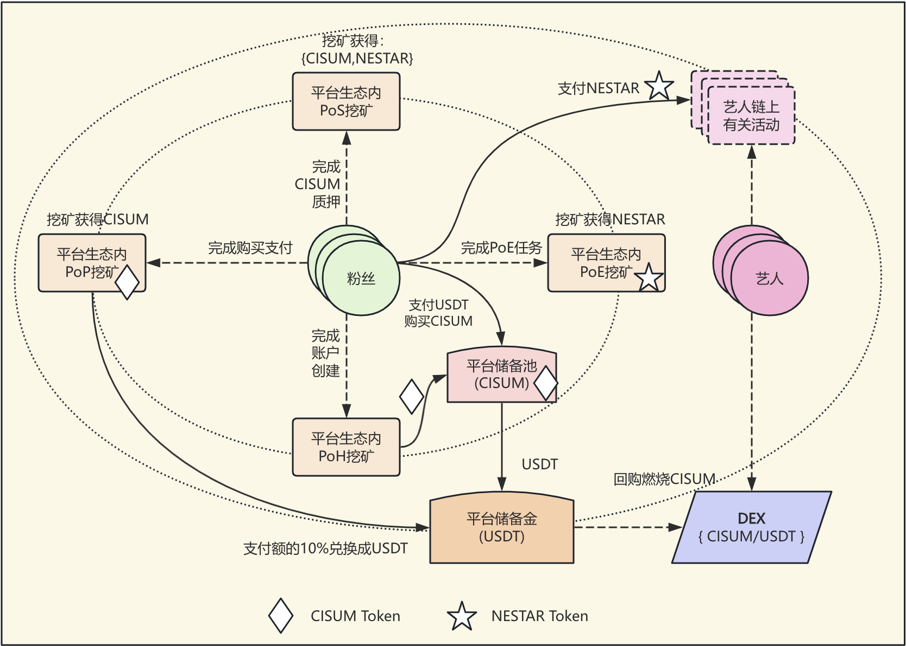
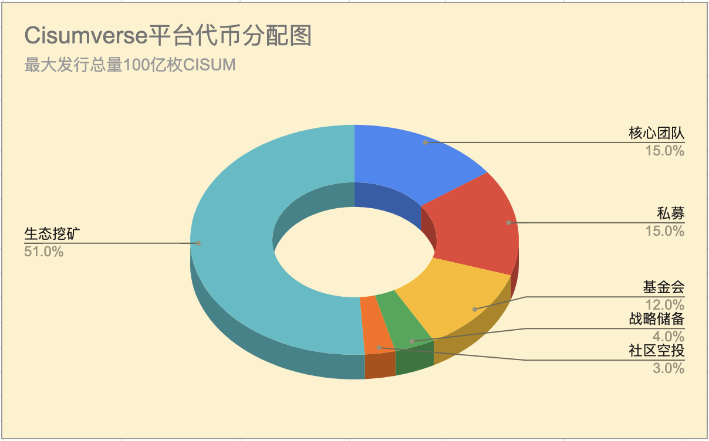

# Cisumverse
**以 Web3 與 A.I. 技術革新音樂與藝術產業**

# 摘要

`Cisumverse` 是全球首個專注於音樂藝人全生命週期孵化的 Web3 平台，建構於高性能 FullOn 公鏈之上，並發行了實用型生態應用代幣 `CISUM` 及其他一系列輔助通證。`Cisumverse` 通過創新的四階段藝人孵化模式、多元化挖礦機制和雙代幣經濟系統，為全球音樂生態參與者提供功能性價值交換工具，推動音樂產業向去中心化、社區驅動的方向發展。作為 `Cisumverse` 平台的原生代幣，`CISUM` 融合 Web3 與 A.I. 技術，建構一個透明、公平的音樂經濟生態，助力新興藝術家成為全球明星，並將粉絲從消費者轉變為投資者和股東。

此外，`Cisumverse` 將藝人成長、版權發行、藝人演出、藝人自身 IP 等各方面通過鑄造 `Real World Asset` (RWA) 的方式將藝人與粉絲的權益高效連結並實現智能化的全生命週期管理。

> [!NOTE]
> 重要聲明：`CISUM` 是實用型代幣（Utility Token），專門用於生態系統內的功能性應用與服務支付，不代表任何公司股權、債權或投資合約，不具備證券屬性。

# 1. 引言

## 1.1 音樂產業的結構性挑戰
傳統音樂產業長期面臨價值分配不均、中介成本高昂、藝術家收益微薄等結構性問題。現有 Web3 音樂平台雖然引入了去中心化概念，但普遍存在以下痛點：

- `過度強調去中心化`：忽略了藝術家歸屬感和粉絲粘性這兩個音樂產業的核心要素
- `商業模式單一`：主要依賴 NFT 投機，缺乏可持續的收益模式
- `用戶體驗差`：技術門檻高，普通用戶難以參與
- `代幣價值支撐不足`：缺乏實際使用場景和價值錨定

## 1.2 Cisumverse的解決方案

`Cisumverse` 通過四階段藝人孵化模式，融合 Web2 成功經驗與 Web3 技術創新，解決了傳統 Web3 音樂平台的核心痛點。`Cisumverse` 作為全球首創的專注於音樂藝人全生命週期孵化的 Web3 平台（`Cisumverse Artist Incubation Platform`, CAIP），結合 A.I. 分析、藝人成長 RWA、版權發行 RWA、藝人演出 RWA、藝人 IP RWA，提供從藝人發掘到元宇宙擴展的全流程支持：

- `重建藝人歸屬感`：通過簽約藝人模式，建立平台與藝人的深度綁定關係;
- `增強粉絲粘性`：通過多元化互動和收益分享，提升粉絲對平台的忠誠度;
- `多元化收益模式`：整合訂閱、廣告、周邊、演出等多種收入來源;
- `實用價值支撐`：基於實際收入的 `10%` 綁定機制，確保代幣價值有實際支撐;

核心流程包括藝人發現與選拔（web2 方法 + AI 分析）、藝人培養與發展（投融資 + 培訓 + 線下巡演 + RWA)、明星成就與商業化（全球巡演 + 品牌合作 + 周邊產品銷售）、數字巨星與元宇宙擴展（IP RWA + 虛擬演唱會 + 鏈遊）。

## 1.3 Cisumverse的三大核心策略

**Cisumverse** 利用 Web3 與 AI 技術，通過三大核心策略賦能年輕藝術家實現明星夢想：

1. **萬物代幣化**

| 代幣       | 類型 | 使用/權益/收益                     | 獲取方式                     |
|------------|------|------------------------------------|-----------------------------|
| `CISUM`    | FT   | 平台級代幣，用於激勵生態系統貢獻者和支持者 | 通過私募或去中心化/中心化交易所 |
| `NESTAR`   | NFT  | 用作在服務/內容/產品消費的信用點數，可參訪搶免費門票 | 通過質押 CISUM 鑄造或參與 `PoE` 活動 |
| `Badge NFTs`| NFT  | 以 `普通`/`銀級`/`金級`/`白金` 等徽章類型表示會員等級 | 當消耗的 `NESTAR` 數量達到指定水平時可領取 |
| `Ticket NFTs`| NFT | 每場演出擁有獨特的門票 NFT 集合 | 通過搶票活動或直接購買獲得 |

2. **萬物挖礦**

**Cisumverse** 通過 Web3 提供多種挖礦機制，使用戶能夠獲得獎勵。從帳戶創建到參與、支付和質押，每項活動都以 `CISUM` 或 `STAR` 代幣形式創造價值，為藝術家和粉絲建構一個充滿活力的生態系統。

| 挖礦類型             | 描述                                                           |
|-----------------------|-------------------------------------------------------------|
| `PoH`：註冊證明      | 每個新帳戶註冊將新鑄造價值 $20 的 `CISUM` 代幣和 100 個 `NESTAR` 積分     |
| `PoE`：參與證明      | 參與藝術家或項目互動活動以挖掘 `NESTAR` 代幣                         |
| `PoP`：支付證明      | 付款者將獲得相當於支付金額 `10%` 的新鑄造 `CISUM` 代幣                |
| `PoS`：質押證明      | `CISUM` 代幣質押者將根據選定的鎖定期間獲得固定年化收益率的利息獎勵，獎勵為新鑄造的 `CISUM` 代幣或 Nestar 積分 |

> [!NOTE]
> 範例 PoE 活動包括但不限於以下內容：
>  - 每日簽到藝術家社群
>  - 邀請他人加入藝術家社群
>  - 在社交媒體上發布/分享藝術家活動
>  - 播放藝術家音樂
>  - 與他人分享藝術家音樂
>  - 購買藝術家相關產品

3. **粉絲投資藝術家**

粉絲可以通過參與短期項目（例如現場演出活動）、中長期事業（5-10 年，支持藝術家成為明星）或終身項目（例如服務於線上或鏈上社區的 3D 數字自主 AI 智能體）的籌資，成為他們喜愛的藝術家的投資者和股東。通過投資，粉絲將獲得代表股份的 NFT 代幣，並賺取相當於項目收入 10% 的 CISUM。此外，NFT 持有者可以對其投資項目進行治理決策投票。

## 1.4 CISUM的定位與願景

`CISUM` 是一個純粹的生態應用代幣，其核心價值在於：
- 作為音樂生態系統內的功能性工具和價值交換媒介
- 激勵生態參與者的貢獻行為和創作活動
- 促進藝術家與粉絲之間的直接價值連接
- 實現去中心化治理和社區共建功能

**Cisumverse** 致力於建構一個無國界、透明且公平的音樂與藝術生態系統，通過區塊鏈、智能合約和去中心化治理，我們賦能藝術家及其社區，共同打造一個可持續、充滿活力且協作的未來。作為先鋒平台，**Cisumverse** 助力新興藝術家成為全球明星。借助 Web3 與 A.I. 技術，我們促進藝術家與粉絲之間的真誠連接，推動互動、共享成功並開啟無限創意可能。

# 2. 生態系統整體架構

以下展示了藝術家、粉絲與平台之間的互動流程高階圖表，展示各種挖礦機制：

<h4 align="center" style="color:grey;font-weight: normal;">圖表-1：CISUM 生態系統架構圖</h4>

> [!NOTE]
> 1. 隨著平台擴展至全球市場，可建立任意數量的藝術家社群。
> 2. 每個藝術家社群需將其平台收入的 10% 作為對平台基金的貢獻。
> 3. 平台需使用平台基金回購並燃燒 CISUM 代幣，以創造持續的通縮效應。

# 3. CISUM 代幣分配

## 3.1 CISUM代幣分配圖

`CISUM` 總供應量為 `100 億`，其中 `51%` 需通過生態系統活動挖掘。以下圖表顯示平台代幣的整體分配。

<h4 align="center" style="color:grey;font-weight: normal;">圖表-2：CISUM 代幣分配圖</h4>

## 3.2 CISUM 代幣釋放計劃

| 分配類別           | 百分比   | 代幣數量              | 歸屬計劃                     | 描述                                         |
|-------------------|---------|---------------------|-----------------------------|---------------------------------------------|
| 創始團隊           | 15%     | 15億 CISUM           | 18個月鎖定期，36個月線性解鎖    | 為創始成員保留，遵循歸屬計劃以確保長期一致性。      |
| 私募融資           | 15%     | 12億 CISUM           | 18個月鎖定期，18個月線性解鎖    | 分配給私募早期投資者，設有歸屬期以防止市場拋售。    |
| 基金會             | 12%     | 12億 CISUM           | 無                          | 用於平台開發、研究及基金會治理的社群活動。         |
| 策略儲備           | 4%      | 4億 CISUM            | 無                          | 為未預見的機會及平台穩定措施保留。                |
| 社群空投           | 3%      | 3億 CISUM            | 無                          | 分發給早期用戶及社群成員以促進平台採用和參與。      |
| 生態挖礦           | 51%     | 51億 CISUM           | 無                          | 通過頭部、支付及質押證明挖掘，以激勵參與及生態發展。 |

## 3.3 CISUM 代幣流通計劃

<h4 align="center" style="color:grey;font-weight: normal;">圖表-3：CISUM 流通計劃圖</h4>

# 4. 技術架構

## 4.1 區塊鏈與智慧合約技術的應用

Cisumverse 選擇 [FullOn Network](https://fullon.network) 作為其應用平台，這是一個高效能的 Layer-1 公開區塊鏈，具有以下優勢：
  - **極低手續費**：交易成本低於 $0.0001，確保可負擔性。
  - **高效能**：支持每秒 10,000 次交易，架構可擴展至每秒 100 萬次交易。
  - **低延遲**：實現 0.5 秒區塊間隔和 1 秒最終確認，確保快速交易處理。
  - **互操作性**：以安全高效的方式與其他區塊鏈無縫連接。

此外，FullOn Network 支持 EVM 和 WASM 智慧合約技術，使 Cisumverse 能夠實現高度去中心化的解決方案，滿足其特定需求。

## 4.2 人工智能技術的應用

**Cisumverse** 與領先的人工智能技術提供商合作，為藝術家打造虛擬內容和自主 3D 數字代理，建構虛擬音樂會空間，吸引全球觀眾。這些 AI 驅動的 3D 代理在線上和鏈上生態系統中代表藝術家，與粉絲互動，舉辦虛擬活動，並為 NFT 投資者創造收益，助力藝術家與粉絲建立持久連接。

# 5. 團隊

## 5.1 創始合作夥伴

- **STAR NEST**：亞洲音樂推廣與交易平台，由 Zorror Xu 創立。
- **ZENITH Entertainment Group**：K-pop 先驅，前 SM 娛樂 CEO，培養超過 10 個頂尖 K-pop 團體，粉絲群超過 5,000 萬。
- **INQ**：越南最大的獨立音樂公司，簽約 7 位藝術家，擁有超過 1,000 萬粉絲。
- **About Capital Management**：專注於私募股權投資，擁有 Huobi 全球交易所，提供亞太市場的資產管理服務。
- **FullOn Blockchain**：Cisumverse 的技術基礎，支持鏈上發行、流通和交易 Cisumverse 代幣，並通過一系列治理智慧合約實現代幣經濟學。

## 5.2 策略合作夥伴

- **United Entertainment Group**：騰訊音樂娛樂集團旗下品牌，負責藝術家、音樂會及音樂節投資管理。
- **Kazakhstan OZEN XO LLP**：中亞最大的版權交易平台，為超過 600 位獨立音樂家分發作品。
- **CAPITAL Theater**：越南知名獨立音樂場地，容量 2,000 人，每年舉辦超過 100 場演出，吸引超過 10 萬名觀眾。
- **香港 SATELITE 電子音樂品牌**：由 Lane Crawford 集團共同創始人 Janva Tam（譚樹中）創立，為 LVMH 組織超過 100 場全球活動。SATELITE 每年舉辦超過 100 場電子音樂派對，粉絲會員超過 10 萬。

## 5.3 領導團隊

- **Dow**：策略與財務，投資專家。
- **Zorro**：藝術家發掘與內容策劃，前華納唱片區域總裁。
- **Jun Kang**：藝術家培訓與版權推廣，前 SM 娛樂 CEO。
- **Michael Choi**：藝術家發展與版權製作，知名英國音樂製作人。
- **Thor**：技術架構，FullOn 區塊鏈創始人。

# 6. 治理模式

- **初始治理（2025-2028）**：Cisumverse 基金會（註冊於開曼群島）負責監督策略規劃、代幣發行及生態系統管理，確保合規性和初期穩定。
- **過渡治理（2028-2029）**：逐步轉向去中心化治理，由粉絲 DAO 主導，粉絲通過 CISUM 質押和徽章系統參與決策。
- **完全去中心化治理（2029年起）**：粉絲 DAO 完全接管，粉絲與藝術家共同決定平台發展、藝術家簽約及收入分配，建立真正的社群共治生態系統。

> [!TIP]
> 本白皮書中呈現的所有參數值均需接受未來 DAO 治理的調整，以適應動態變化的市場環境。

# 7. 結論：與 Cisumverse 共創音樂未來

Cisumverse 代表音樂產業未來的變革願景。通過技術創新和社群治理，我們致力於構建一個公平、透明、可持續的生態系統，將全球音樂推向 Web3 時代。加入我們，一起塑造音樂的未來。