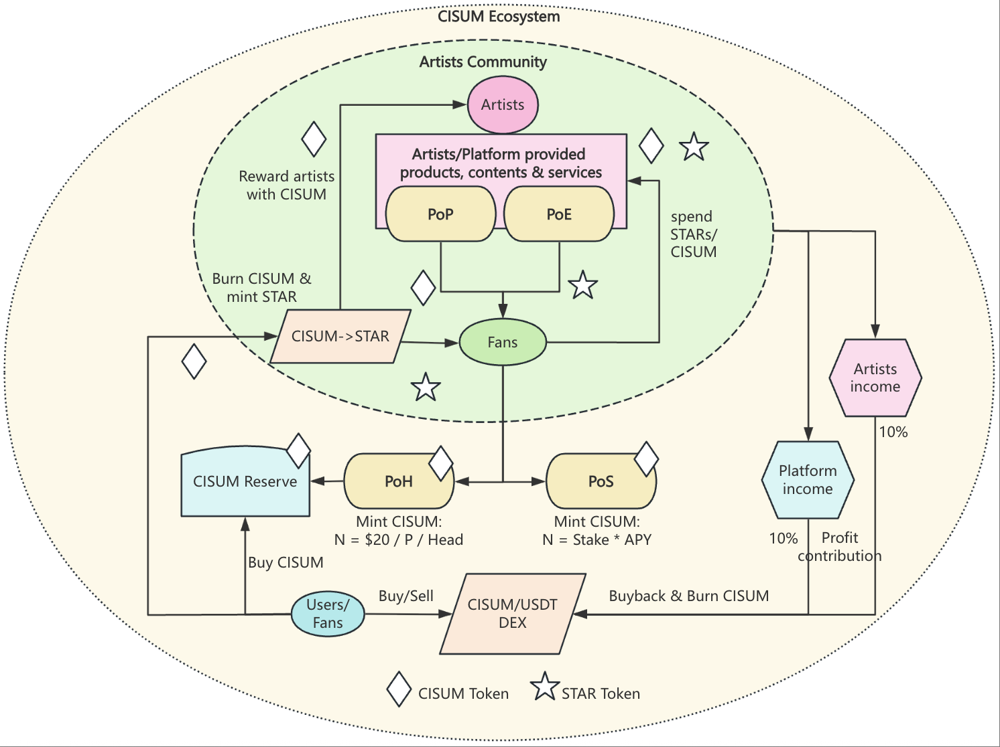
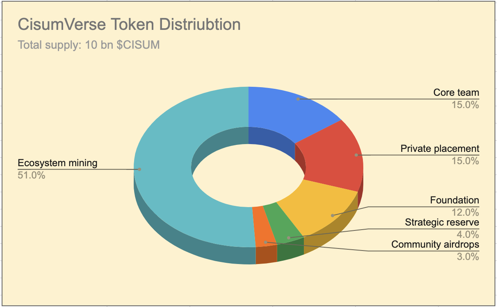
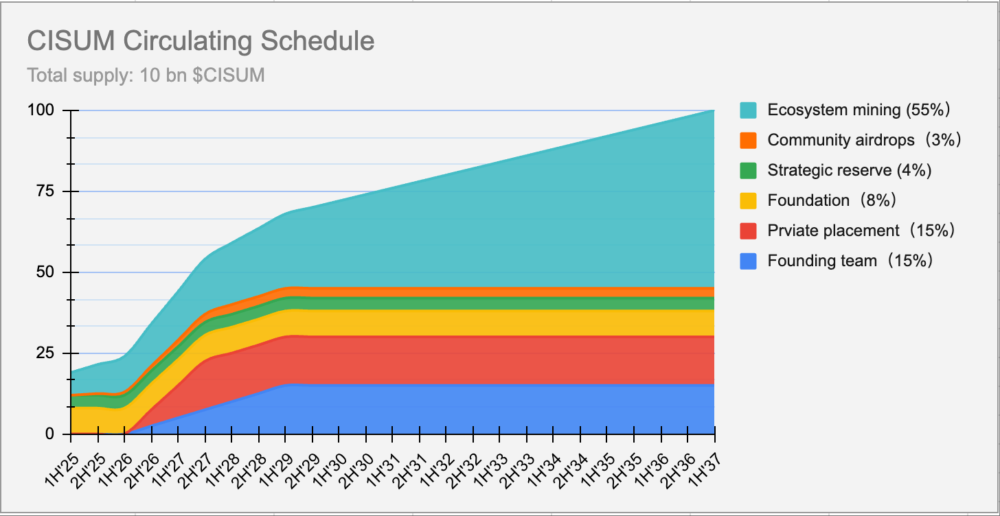

`Cisumverse White Paper`

# **Cisumverse**
**Revolutionizing the Music & Arts Industry with Web3 & A.I.**

# Overview

Cisumverse is the world’s first Web3 platform focused on the full lifecycle incubation of music artists (`Cisumverse Artist Incubation Platform`, **CAIP**). Integrating traditional music industry expertise with Web3 technology, it leverages the high-performance FullOn blockchain, a four-stage artist incubation model, CISUM token economics, and smart contracts to create a transparent, fair, and decentralized music economy, fostering new value connections for artists, fans, institutions, and investors.

**Core Processes:**

- **Artist Discovery**: Identifies promising talent through Web2 mechanisms (e.g., global music competitions, label partnerships) and AI-driven analysis.
- **Artist Development**: Offers financing, training, tours, and Web3 fan engagement to boost visibility.
- **Star Commercialization**: Organizes music festivals, global tours, and brand collaborations to elevate artists to regional or global stardom.
- **Metaverse Expansion**: Creates virtual artist avatars, issues NFTs, and develops virtual concerts and blockchain games for cross-platform interaction.

Cisumverse addresses traditional music industry issues like unfair revenue distribution and limited artist growth, while overcoming Web3 music platform challenges (e.g., volatile token values, low NFT liquidity, and insufficient user engagement), driving a revolutionary transformation in the music industry.

# Vision

**Cisumverse** envisions a borderless, transparent, and equitable ecosystem for music and the arts, powered by Web3 technology. By leveraging blockchain, smart contracts, and decentralized governance, we empower artists and their communities to create a sustainable, vibrant, and collaborative future.

As a pioneering platform, **Cisumverse** transforms emerging artists into global stars. Through Web3, we foster authentic connections between artists and their fans, driving engagement, shared success, and limitless creative possibilities.

# Strategy

**Cisumverse** harnesses Web3 and AI technologies to empower young artists to achieve stardom through three core strategies:

1. **Tokenizing everything**

**Cisumverse** transforms assets and opportunities into digital tokens, enabling seamless investment, ownership, and governance.

| Token      |  Type      | Usage/Privileges/Benefits | Ways to acquire                 |
|------------|------------|---------------------------|---------------------------------|
| `CISUM`    | FT  | A platform-level token to incentivize ecosystem contributors and believers | via private sales or DEX/CEX  |
| `GRAB`     | NFT | Used to grab a free ticket in platform organized ticket-rush sessions | via account registration or inviting other to register on-chain |
| `NESTAR`   | NFT | Used as credit points for spending in services/contents/products, unique for each artists community | via burning CISUM to mint or `PoE` activities |
| Badge NFTs   | NFT | Membership levels denoted by `Common`/`Silver`/`Gold`/`Platinum` etc. badge types | claimable when the quantity level of spent `NESTAR`reaches |
| Ticket NFTs| NFT | Each show has a unique set of ticket NFTs | via ticket-rush sessions or direct purchase |

> [!NOTE]
> In addition to its potential for appreciating financial value, CISUM token holders gain governance rights, participating in platform-wide decision-making through voting processes organized by the Cisum Foundation.
> The ultimate goal for CISUM is to become the settlement medium for music and arts industry and transfer music/arts fans from consumers to shareholders, producers and DAO governors.

2. **Mining everything**

**Cisumverse** enables users to earn rewards through diverse mining mechanisms powered by Web3. From account creation to engagement, payments, and staking, every action generates value in the form of CISUM or STAR tokens, fostering a vibrant ecosystem for artists and fans.

| Mining Type           | Description                                                    |
|-----------------------|----------------------------------------------------------------|     
| Proof of Head(PoH)    | `CISUM` tokens worth of `$20` will be newly minted upon each new account registration |
| Proof of Engagement(PoE) | Whichever artists or projects engagement activites for minging `NESTAR` tokens.         |  
| Proof of Payment(PoP) | Payers will be rewarded with newly minted `CISUM` tokens worth of `10%` of the paying amount. |
| Proof of Stake(PoS)   | Stakers of `CISUM` tokens will be rewarded with a fixed APY of interest based on their selected locking period duration. The interest rewards are newly minted `CISUM` tokens |

> [!NOTE]
> Example PoE activies include but are not limited to the following:
>  - daily sign-in to an artists community
>  - inviting others to join an artists community
>  - posting/sharing artists events in social medias
>  - Playing artists music
>  - Sharing artists music with others
>  - purchasing artists related items

3. **Fans investing in artists**

Fans can become investors and shareholders in their favorite artists by participating in fundraising for short-term projects (e.g., live events), medium-to-long-term ventures (5–10 years, supporting artists’ rise to stardom), or lifelong initiatives (e.g., 3D Digital Autonomous AI Agents serving online or on-chain communities). By investing, fans receive NFT tokens representing shares, earning CISUM equivalent to 10% of the project’s revenue. Additionally, NFT holders can vote in governance decisions for their invested projects.

# Ecosystem overall architecture

The diagram below illustrates the high-level interaction flows between artists, fans, and the platform, highlighting various mining mechanisms:

<h4 align="center" style="color:grey;font-weight: normal;">Figure-1: CISUM Ecosystem Architecture Diagram</h4>

> [!NOTE]
> 1. There can be as many artisits communities as possible as the platform grows to reache the global markets.
> 2. Each artisits community is required to put aside 10% of their platform income as contribution to the platform fund.
> 3. The platform is required to use the platform fund to buy back and burn CISUM tokens to create continuous deflation effect to CISUM.

## Token distribution

The total supply of `CISUM` is `10 billion`, `51%` of which has to be mined through ecosystem activities. Following diagram shows the overall distribution of the platform token.

<h4 align="center" style="color:grey;font-weight: normal;">Figure-2: CISUM Token Distribution Diagram</h4>

# CISUM Token Distribution Schedule

| Allocation Category        | Percentage | Token Amount         | Vesting Plan | Description          | 
|----------------------------|------------|----------------------|--------------|----------------------|
| Core Team                  | 15%        | 1,500,000,000 CISUM  | 18-month cliff, 36-month linear unlock | Reserved for founding members, subject to vesting schedules to ensure long-term alignment.         |
| Private Fundraising        | 15%        | 1,200,000,000 CISUM  | 18-month cliff, 18-month linear unlock | Allocated to early investors from private sales, with vesting to prevent market dumping.           |
| Foundation                 | 12%        | 1,200,000,000 CISUM    | N/A | Used for platform development, research, and community initiatives governed by the foundation.     |
| Strategic Reserve          | 4%         | 400,000,000 CISUM    | N/A | Held for unforeseen opportunities and platform stability measures.                                 |
| Community Airdrops         | 3%         | 300,000,000 CISUM    | N/A | Distributed to early users and community members to encourage platform adoption and engagement.    |
| Ecosystem Mining           | 51%        | 5,100,000,000 CISUM  | N/A | Mined via Proof of Head, Payment and Stake to incentivize participation and ecosystem development. |

## CISUM Token Circulating Schedule

<h4 align="center" style="color:grey;font-weight: normal;">Figure-3: CISUM Circulating Schedule</h4>

# Technology

## Employment of Blockchain and Smart Contract technology

**Cisumverse** has selected [FullOn Network](https://fullon.network), a high-performance Layer-1 public blockchain, as its application platform due to the following advantages:
  - **Ultra-low gas fees:** Transactions cost less than $0.0001, ensuring affordability.
  - **High performance:** Supports 10,000 TPS, with an architecture scalable to 1 million TPS.
  - **Low latency:** Achieves 0.5-second block intervals and 1-second finality for rapid transaction processing.
  - **Interoperbility:** Seamlessly connects with other blockchains in a secure and efficient manner.

Furthermore, FullOn Network supports both EVM and WASM smart contract technologies, enabling **Cisumverse** to implement a highly decentralized solution tailored to its needs.

## Employment of A.I. technology

**Cisumverse** collaborates with leading AI technology providers to create virtual content and autonomous 3D digital agents for artists, building virtual concert spaces that engage global audiences. These AI-powered 3D agents represent artists in online and on-chain ecosystems, interacting with fans, hosting virtual events, and generating revenue for NFT investors, fostering lasting artist-fan connections.

# Team

## Founding partners

- **STAR NEST**: The music promition and trading platform in Asia, founded by Zorror Xu.
- **ZENITH Entertainment Group**: K-pop pioneer, former SM Entertainment CEO, has nurtured over 10 top K-pop groups, with a fanbase exceeding 50 million.
- **INQ**: Largest independent music company in Vietnam, signed 7 artists, with over 10 million fans.
- **About Capital Management**: Focused on private equity investment, owns Huobi Global Exchange, providing asset management services in the Asia-Pacific market.
- **FullOn Blockchain**: The technical foundation of **Cisumverse**, supporting on-chain issuance and circulating and trading of **Cisumverse** tokens and implmenting the tokenomics via a suite of governing smart contracts.

## Strategic partners

- **United Entertainment Group**: Tencent Music Entertainment Group's brand responsible for artist, concert, and music festival investment management.
- **Kazakhstan OZEN XO LLP**: Central Asia's largest copyright trading platform, distributing works for over 600 independent musicians.
- **CAPITAL Theater**: A renowned independent music venue in Vietnam, with a capacity of 2,000 people, hosting over 100 performances annually, and attracting more than 100,000 attendees.
- **Hong Kong SATELITE Electronic Music Label**: Founded by Janva Tam (Tan Shu Zhong), co-founder of Lane Crawford Group, who has organized over 100 global events for LVMH. SATELITE hosts over 100 electronic music parties annually, with a fan membership exceeding 100,000.

## Leadership team

- **Dow**: Strategy and Finance, financial investment expert.
- **Zorro**: Artist discovery and content planning, former regional president of Warner Records.
- **Jun Kang**: Artist training and copyright promotion, former CEO of SM Entertainment.
- **Michael Choi**: Artist development and copyright production, renowned British music producer.
- **Thor**: Technical architecture, founder of the FullOn blockchain.

# Governance Model

- **Initial Governance (2025-2028)**: The Cisum Foundation (registered in the Cayman Islands) oversees strategic planning, token issuance, and ecosystem management to ensure compliance and initial stability.
- **Transitional Governance (2028-2029)**: Gradually shifts to decentralized governance under Fans DAO, with fans participating in decision-making through CISUM staking and a badge system.
- **Fully Decentralized Governance (2029 onward)**: Fans DAO fully takes over, with fans and artists collectively deciding platform development, artist signings, and revenue distribution, building a true community co-governance ecosystem.

> [!TIP]
> All parameter values presented in this paper are subject to future DAO governance to adapt to a dynamically changing market environment.

# Conclusion: The Future of Music with CISUM

CISUM represents a transformative vision for the future of the music industry. Through technological innovation and community governance, we aim to build a fair, transparent, and sustainable ecosystem, propelling global music into the Web3 era. Join us in shaping the future of music.