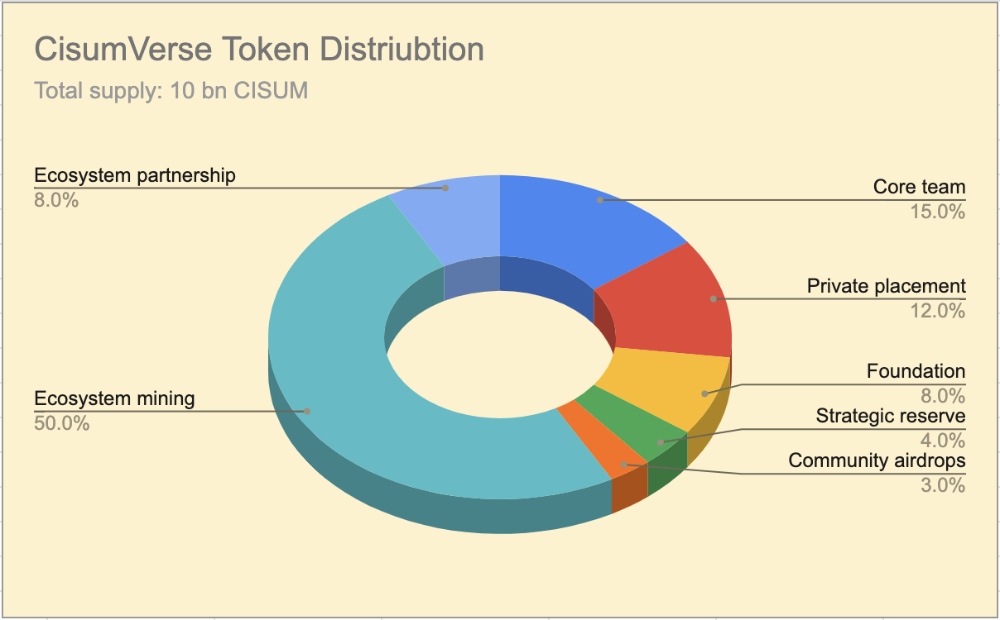

`Cisum Verse White Paper`

# Cisum Verse
**Revolutionizing the Music & Arts Industry with Web3**


# Introduction

Music and the arts are foundational to human civilization, yet the industry suffers from longstanding challenges deeply rooted in traditional and Web2 structures:

- `Centralization`: Data and assets are controlled by centralized platforms, resulting in concentrated power, manipulation, and high fees for creators and fans.
- `Lack of Transparency`: Opaque data flows and restricted access to information about asset ownership and value growth often lead to users' and creators' interests being compromised.
- `Low Efficiency`: Web2 architectures impose excessive borders, hindering payment, settlement, and global reach for both artists and audiences.
- `Inequitable Value Distribution`: Major intermediaries maximize their profits at the expense of creators and fans, stifling innovation and sustainability across the industry.


# Vision

We, at Cisum Verse, envision a borderless, transparent, and equitable ecosystem for music and the arts, powered by Web3 technology. By leveraging blockchain, smart contracts, and decentralized governance, we return power to creators and communities — unlocking a sustainable, vibrant, and collaborative future.

Cisum Verse is a pioneering platform dedicated to nurturing emerging artists into fully-fledged stars by leveraging Web3 technologies to connect them with their rapidly growing fan communities.

# Solutions

Cisum Verse leverages Web3 technology to empower young artists in realizing their dreams of becoming stars through the following key ways:

1. **Breaking Traditional Barriers and Directly Connecting with Fans**
   Through a decentralized blockchain platform, artists can engage directly with a global fanbase without relying on traditional record labels or intermediaries, thereby expanding their influence and community.

2. **Digital Assetization and Intellectual Property Protection**
   Artists’ music works and artworks are tokenized as NFTs, ensuring the uniqueness and tamper-proof proof of ownership, protecting their intellectual property rights and revenue streams.

3. **Transparent Revenue Distribution Mechanism**
   Smart contracts automate real-time royalty and income distribution, guaranteeing artists receive fair and transparent compensation while eliminating middlemen’s share typical in traditional industries.

4. **Fan Engagement and Community Governance**
   By issuing dedicated fan tokens (such as credit tokens), fans can participate in voting, decision-making on artist activities and content direction, fostering closer community bonds, enhancing loyalty, and building a sustainable ecosystem.

5. **Innovative Financing and Monetization Channels**
   Web3 offers diverse funding and incentive models, enabling artists to raise capital via NFT sales, token staking, and more; fans can directly invest in artists and share in their growth and success.

6. **Borderless Global Market and Participation**
   Web3 lowers geographic and economic barriers, allowing fans worldwide to equally participate in supporting and growing artists’ careers, helping artists expand international reach and achieve true globalization.


# Tokenomics

Cisum Verse employs a two-level token model for the entire ecosystems:
- level-1: `CISUM` token as the unique platform token to power the continuous development of the ecosystem
- level-2: Credit tokens (codename as `xSTAR`) for Artists or projects to encourange rewarding fans engaging activities. `xSTAR` can be used in many artisits or projects actvities ranging from buying a ticket to swag products like bags/cups/shirts...etc, to NFT items, to taking photos or having dinner with the artisits...to just name a few.

Below shows the high-level diagram of interaction flows between artists, fans and the platform with exhibition of various mining mechanisms:


```
There can be as many artisits communities as possible as the platform grows to reache the global markets.
```
| Category             | Description   | Mining              |
|----------------------|---------------|----------------------|
| `PoH`: Proof of Head | Proof of a real person that creats an on-chain account | Each account helps to mint the amount of `CISUM` tokens woth of `$20` |
| `PoP`: Proof of Payment | A proof whereby fans buy certain contents, products or services by spending fiat money or crypto stable tokens like `USDT` | `10%` of each transaction value will be converted into newly minted `CISUM` to reward the buyer;
| `PoS`: Proof of Stake | All users can stake `CISUM` tokens to in order to earn interests in `CISUM` tokens | The PoS interests are newly minted according to a predefined interest schedule. The one-year staking plan offers an APY of 3.6%. | 
| `PoE`: Proof of Engagement | Fans engage with their favourite artists or artists related projects for their contents, products or services and get rewarded for `xSTAR` that is unque to each artist (or artists group). There is no upper limit for the total amount of `xSTAR` as long as fans keep engaging with the artists or their related projects | Fans first earn `xSTAR` as artisits credit points and VIP-level fans can swap `xSTAR` for CISUM tokens that reside in artisits CISUM reserve pool | 

## Ecosystem mining

There can be an infinite amount of activities to interact or engage with artists or their related projects. Following are a list of example activities that can be conducted to earn `xSTAR` credit tokens:
- Sign into the Cisum Verse APP daily
- Vote for one's favourite artist
- Watch short videos generated in the artists events
- Invite friends to join the community
- Upload audition contents by artists
- Play music to earn
- Share music with others to earn


## Token distribution

The total supply of `CISUM` is `10 billion`, `50%` of which has to be mined through ecosystem activities. Following diagram shows the overall distribution of the platform token.




# CISUM Token Distribution Schedule

| Allocation Category        | Percentage | Token Amount         | Vesting Plan | Description                                                |
|----------------------------|------------|----------------------|--------------|------------------------------------------------------------|
| Founding Team              | 15%        | 1,500,000,000 CISUM  | 18-month cliff, 36-month linear unlock | Reserved for founding members, subject to vesting schedules to ensure long-term alignment.         |
| Private Fundraising        | 12%        | 1,200,000,000 CISUM  | 18-month cliff, 18-month linear unlock | Allocated to early investors from private sales, with vesting to prevent market dumping.           |
| Foundation                 | 8%         | 800,000,000 CISUM    | N/A | Used for platform development, research, and community initiatives governed by the foundation.     |
| Ecosystem Partnership     | 8%         | 800,000,000 CISUM    | 18-month cliff, 36-month linear unlock | Reserved for strategic partners to promote ecosystem growth and integrations.                      |
| Strategic Reserve          | 4%         | 400,000,000 CISUM    | N/A | Held for unforeseen opportunities and platform stability measures.                                 |
| Community Airdrops         | 3%         | 300,000,000 CISUM    | N/A | Distributed to early users and community members to encourage platform adoption and engagement.    |
| Ecosystem Mining          | 50%        | 5,000,000,000 CISUM  | N/A | Mined via Proof of Head, Payment and Stake to incentivize participation and ecosystem development. |

## CISUM Token Circulating Schedule

# Technology

## Blockchain selection

FullOn Network has been selected as the application platform for Cisum Verse for its ultra-low gas fee and high performance and unique goal of being the application chain to all other chains by its powerful built-in interoperbility.

1. Smart contracts

# Note:

All parameter values as depicted in this paper are subject to `DAO` governance in the future to adapt to a dynicmlly channing market environment.