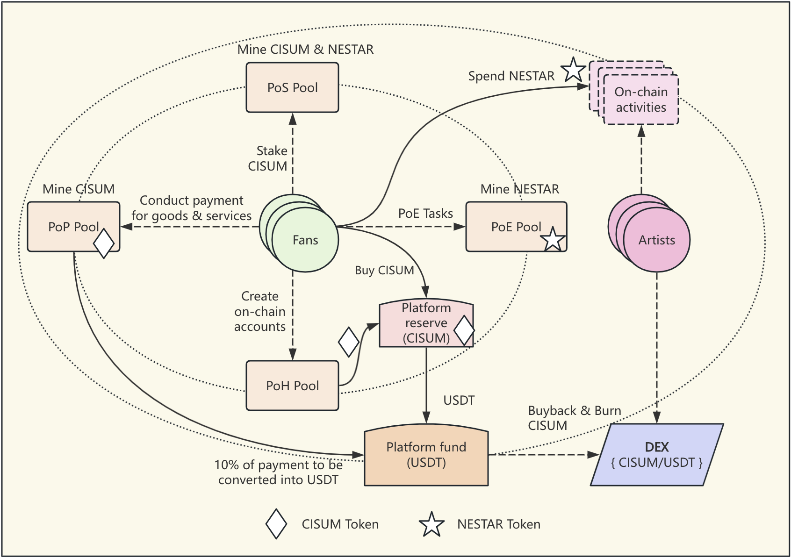
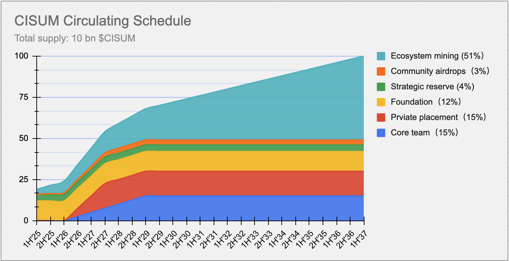

`Cisum Verse White Paper`

# Cisum Verse
**Revolutionizing the Music & Arts Industry with Web3**


# Introduction

Music and the arts are foundational to human civilization, yet the industry suffers from longstanding challenges deeply rooted in traditional and Web2 structures:

- `Centralization`: Data and assets are controlled by centralized platforms, resulting in concentrated power, manipulation, and high fees for creators and fans.
- `Lack of Transparency`: Opaque data flows and restricted access to information about asset ownership and value growth often lead to users' and creators' interests being compromised.
- `Low Efficiency`: Web2 architectures impose excessive borders, hindering payment, settlement, and global reach for both artists and audiences.
- `Inequitable Value Distribution`: Major intermediaries maximize their profits at the expense of creators and fans, stifling innovation and sustainability across the industry.


# Vision

We, at Cisum Verse, envision a borderless, transparent, and equitable ecosystem for music and the arts, powered by Web3 technology. By leveraging blockchain, smart contracts, and decentralized governance, we return power to creators and communities — unlocking a sustainable, vibrant, and collaborative future.

Cisum Verse is a pioneering platform dedicated to nurturing emerging artists into fully-fledged stars by leveraging Web3 technologies to connect them with their rapidly growing fan communities.

# Solutions

Cisum Verse leverages Web3 technology to empower young artists in realizing their dreams of becoming stars through the following key ways:

1. **Issuing various on-chain tokens**

| Token Name | Token Type | Usage/Privileges/Benefits | Ways to acquire                 |
|------------|------------|---------------------------|---------------------------------|
| `CISUM`    | FT  | a platform-level token to incentivize ecosystem contributors and believers | via private sales or DEX/CEX  |
| `CVSBT`    | NFT | a soul-bound token that measures holders overall contribution | via spending within the platform and ecosystem |
| `GRAB`     | NFT | used to grab a free ticket in platform organized ticket-rush sessions | via account registration or inviting other to register on-chain |
| STAR NFTs| NFT | used as credit points for spending in services/contents/products, unique for each artists community | via burning CISUM to mint or `PoE` activities |
| Badge NFTs   | NFT | Membership levels denoted by `Common`/`Silver`/`Gold`/`Platium` etc. badge types | claimable when the quantity level of `CVSBT`reaches |
| Ticket NFTs| NFT | Each show has a unique set of ticket NFTs | via ticket-rush sessions or direct purchase |

2. **Conducting various mining activities**

| Mining Type              | Description                                                                           |
|--------------------------|---------------------------------------------------------------------------------------|
| `PoH`: Proof of Head     | `CISUM` tokens worth of `$20` will be newly minted upon each new account registration |
| `PoE`: Proof of Engagement | Whichever artists or projects engagement activites for minging STAR tokens.         |  
| `PoP`: Proof of Payment | Payers will be rewarded with newly minted `CISUM` tokens worth of `10%` of the paying amount. |
| `PoS`: Proof of Stake | Stakers of `CISUM` tokens will be rewarded with a fixed APY of interest based on their selected locking period duration. The interest rewards are newly minted `CISUM` tokens |

```
Example PoE activies include daily sign-in to a artists community, inviting others to join, posting/sharing events in social medias, purchasing items,...etc
```


# Tokenomics

Cisum Verse employs a two-level token model for the entire ecosystems:
- Level-1: `CISUM` token as the unique platform token to power the continuous development of the ecosystem
- Level-2: Credit tokens (codename as `xSTAR`) for Artists or projects to encourange fans engaging activities. `xSTAR` can be used in many artisits or projects actvities ranging from buying artist live-show tickets to swag products like bags/cups/shirts...etc, to NFT items, to taking photos or having dinner with the artisits...to just name a few.

Below shows the high-level diagram of interaction flows between artists, fans and the platform with exhibition of various mining mechanisms:

<p align="center">

<h4 align="center" style="color:grey;font-weight: normal;">Figure-1: CISUM Tokenomics Diagram</h4>
</p>

```
Note: There can be as many artisits communities as possible as the platform grows to reache the global markets.
```

## Ecosystem mining

There can be an infinite amount of activities to interact or engage with artists or their related projects. Following are a list of example activities that can be conducted to earn `xSTAR` credit tokens:
- Sign into the Cisum Verse APP daily
- Vote for one's favourite artist
- Watch short videos generated in the artists events
- Invite friends to join the community
- Upload audition contents by artists
- Play music to earn
- Share music with others to earn


## Token distribution

The total supply of `CISUM` is `10 billion`, `50%` of which has to be mined through ecosystem activities. Following diagram shows the overall distribution of the platform token.

<p align="center">

<h4 align="center" style="color:grey;font-weight: normal;">Figure-2: CISUM Token Distribution Diagram</h4>
</p>

# CISUM Token Distribution Schedule

| Allocation Category        | Percentage | Token Amount         | Vesting Plan | Description                                                |
|----------------------------|------------|----------------------|--------------|------------------------------------------------------------|
| Founding Team              | 15%        | 1,500,000,000 CISUM  | 18-month cliff, 36-month linear unlock | Reserved for founding members, subject to vesting schedules to ensure long-term alignment.         |
| Private Fundraising        | 12%        | 1,200,000,000 CISUM  | 18-month cliff, 18-month linear unlock | Allocated to early investors from private sales, with vesting to prevent market dumping.           |
| Foundation                 | 8%         | 800,000,000 CISUM    | N/A | Used for platform development, research, and community initiatives governed by the foundation.     |
| Ecosystem Partnership     | 8%         | 800,000,000 CISUM    | 18-month cliff, 36-month linear unlock | Reserved for strategic partners to promote ecosystem growth and integrations.                      |
| Strategic Reserve          | 4%         | 400,000,000 CISUM    | N/A | Held for unforeseen opportunities and platform stability measures.                                 |
| Community Airdrops         | 3%         | 300,000,000 CISUM    | N/A | Distributed to early users and community members to encourage platform adoption and engagement.    |
| Ecosystem Mining          | 50%        | 5,000,000,000 CISUM  | N/A | Mined via Proof of Head, Payment and Stake to incentivize participation and ecosystem development. |

## CISUM Token Circulating Schedule

<p align="center">

<h4 align="center" style="color:grey;font-weight: normal;">Figure-3: CISUM Circulating Schedule</h4>
</p>

# Technology

## Employment of Blockchain technology

FullOn Network has been selected as the application platform by Cisum Verse for its ultra-low gas fee and high performance and unique goal of being the application chain to all other chains by its powerful built-in interoperbility.

## Employment of Smart contract technology

| Category           | Contract name    | Usage description |
|--------------------|------------------|-------------------|
| `CISUM` tokens     | `cisum.token`    | issuing `CISUM` tokens |
| `CISUM` vesting control | `flon.vest` | vesting and linear unlock `CISUM` tokens |
| `xSTAR` tokens     | `xstar.cisum`    | issuing `xSTAR` credit NFT tokens for artists/projects |
| NFT tokens         | `cisum.ntoken`   | issuing NFT tokens for Cisum ecosystem |
| `CISUM` sales      | `sales.cisum`    | sales of `CISUM` tokens minted from artisits reserve |
| `CISUM/USDT` Swap  | `flon.swap`      | Swap Pool DEX |
| `PoH` mining pool  | `poh.cisum`      | mine `CISUM` tokens with new account joining/following the artists groups |
| `PoS` mining pool  | `pos.cisum`      | mine `CISUM` tokens as interests for staking `CISUM` tokens into the pool |
| `PoP` mining pool  | `pop.cisum`      | mine `CISUM` tokens as rewards to buyers who buy products/services/contents within the platform |
| `PoE` mining pool  | `poe.cisum`      | mine `xSTAR` credit NFT tokens with on-chain activities |

```
Note: For off-chain PoE mining activities users will be airdropped with xSTAR credit tokens directly by the platform instead of going through the PoE smart contract for token issuance.
```

# Note:

All parameter values as depicted in this paper are subject to `DAO` governance in the future to adapt to a dynicmlly channing market environment.