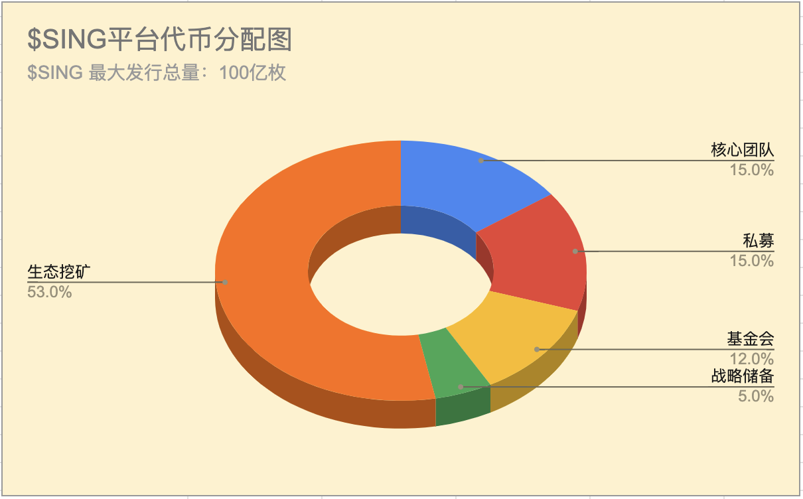
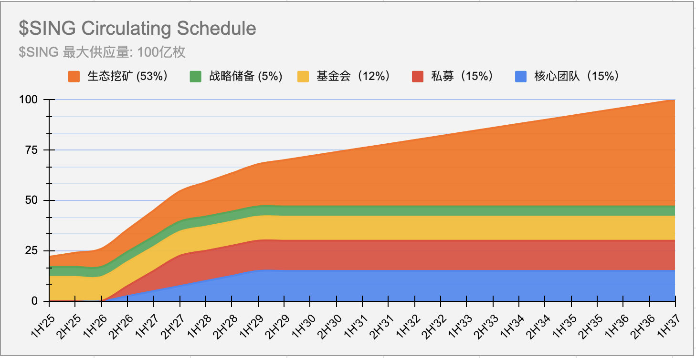
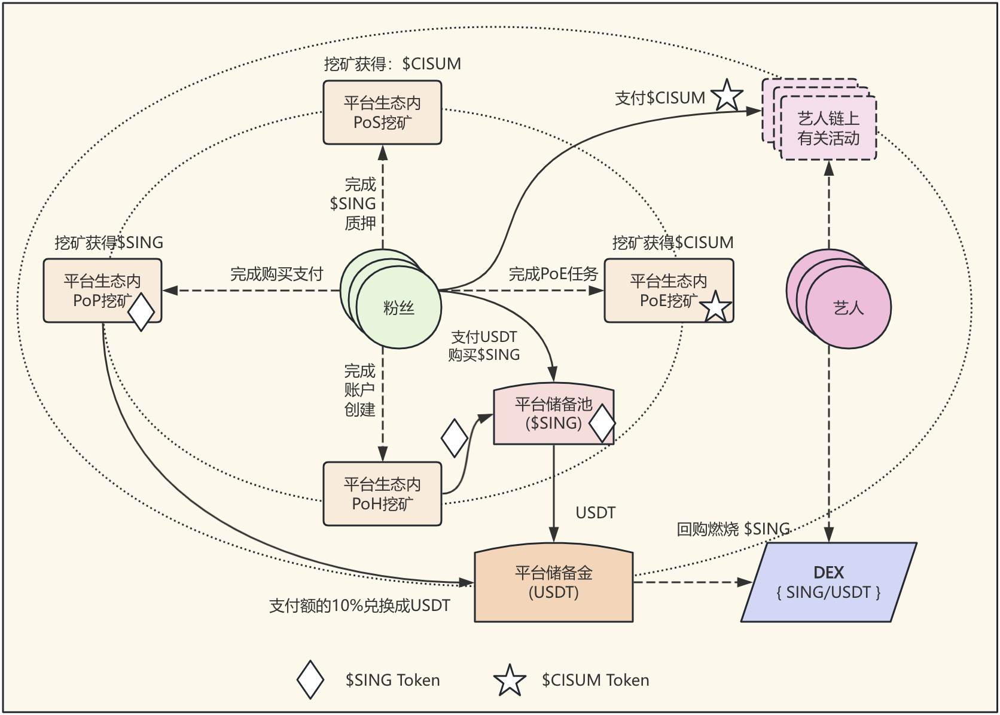

# SING Global：Web3 音樂生態應用平台

# 1. 願景

在目前由中心化平台主導的音樂產業中，藝術家、唱片公司、版權持有人和粉絲之間的價值流動往往受到限制，導致收益分配不公、藝人發展受限以及粉絲黏性不足。 SING Global 的核心願景是利用區塊鏈技術，建立一個公平、透明且去中心化的 Web3 音樂生態系統。作為該平台的唯一音樂原生代幣，SING 將與全球範圍內的音樂機構、公司、版權持有人、藝人及粉絲緊密合作，共同連接音樂的未來。我們的目標是賦能所有希望利用 Web3 技術的音樂參與者，使他們能夠直接進行價值交換和互動，從而打破傳統壁壘，重塑音樂產業的未來。

透過深度融合傳統音樂產業的成功經驗與 Web3 技術，SING Global 將建構一個從潛力新星發掘到元宇宙「孿生數位巨星」的完整生態系統，最終實現透明、公平、去中心化的音樂經濟。

# 2. 產業痛點與機遇

Web2 與 Web3 音樂平台之間存在顯著的結構性差距，凸顯了當前音樂產業的痛點。 Web2 平台（如 Spotify）雖然在藝人歸屬感和粉絲黏性方面表現出色，但其收益分配不公
和藝人發展受限的問題日益突出。相較之下，Web3 平台雖然強調自主性和透明度，卻面臨粉絲黏著度低、商業模式單一以及用戶留存率低於 30% 的挑戰。 SING Global 旨在突破這些困難，為藝人、粉絲、機構和投資者建立一個透明、公平的音樂經濟生態。

全球音樂產業規模已超過 2000 億美元，其中數位音樂佔據主導地位。 Web3 音樂平台正經歷爆發式成長，它們正在重塑價值分配模式，並受到 Z 世代和千禧世代用戶的追捧，全球已有近 80 家此類平台。亞洲音樂市場以超過 15% 的年增長率持續擴大，其成熟的粉絲經濟模式在全球影響力日益增強。 SING Global 將聚焦亞洲市場，進行垂直化深耕，實現Web2 傳統模式與 Web3 創新的深度整合。平台將提供藝人孵化系統、粉絲投資平台、智慧合約管理和社群治理機制，確保藝人獲得全生命週期的服務，粉絲能夠成為投資者和管理者，而機構和投資者也能獲得相應的回報。

# 3. 專案簡介

SING 是 SING Global 去中心化音樂生態系統的原生功能型代幣。它將作為平台的核心價值載體，用於支付、激勵和治理。透過 SING 代幣，我們致力於建立一個全新的音樂經濟模型，讓所有參與者能夠真正擁有數位資產，並從他們的貢獻中獲得應有的回報。 SING Global 獨立於任何單一平台，與全球音樂生態系統廣泛合作，並依托 FullOn 高性能 Layer-1 公鏈的支援。 FullOn 公鏈具備 10 萬 TPS 的處理能力、低成本（0.0002 美元 GAS費）以及多鏈相容性（與 Ethereum、Solana 互通），為 SING Global 提供了強大的技術保障。

# 4. 代幣經濟模型

## 4.1 基本訊息

- `代幣名稱`：SING
- `總發行量`：100 億枚

## 4.2 代幣分配比例

- `生態挖礦`：53%
- `核心團隊`：15%
- `私募輪`：15%
- `基金會`：12%
- `市場儲備`：5%

以下圖表顯示平台代幣的整體分配:

<h4 align="center" style="color:grey;font-weight: normal;">圖表-1：SING 代幣分配圖</h4>

## 4.3 SING 代幣釋放計劃

| 分配類別 | 百分比 | 代幣數量 | 歸屬計劃 | 描述 |
|-------------------|---------|---------------------|-----------------------------|------------------------------------------------|
| 核心團隊 | 15% | 15億 SING | 18個月鎖定期，36個月線性解鎖 | 為創始成員保留，遵循歸屬計劃以確保長期一致性。 |
| 私募 | 15% | 15億 SING | 18個月鎖定期，18個月線性解鎖 | 分配給私募早期投資者，設有歸屬期以防止市場拋售。 |
| 基金會 | 12% | 12億 SING | 無 | 用於平台開發、研究及基金會治理的社群活動。 |
| 戰略儲備 | 5% | 5億 SING | 無 | 保留給未預見的機會及平台穩定措施。 |
| 生態挖礦 | 53% | 53億 SING | 無 | 通過頭部、支付及質押證明挖掘，以激勵參與及生態發展。 |

## 4.4 SING 代幣流通計劃

<h4 align="center" style="color:grey;font-weight: normal;">圖表-2：$SING 流通計劃圖</h4>

> [!TIP]
> `1H` = 上半年, 例：1H'25 = 2025上半年
> `2H` = 下半年, 例：2H'25 = 2025下半年

# 5 代幣用途

SING 代幣將作為生態內的主要支付和價值轉移工具，其主要用途包括：
- `生態系統支付`：用於購買音樂 NFT、虛擬演唱會門票、週邊商品等。
- `治理`：代幣持有者將擁有對生態未來發展提案的投票權，包括 DAO 治理。
- `激勵`：激勵藝術家創作、粉絲互動以及節點驗證等行為。

SING 的經濟模式強調 「實際收入 + 資產支持 + 通貨緊縮機制」。 POP（Proof of Purchase）是主要的挖礦模式，其中 50% 的交易手續費將用於回購銷毀，另有 10% 的平台收入將持續用於回購和燃燒，以確保價值的穩定增長並避免投機性波動。此外在生態內廣泛使用的積分代幣由 POS (Proof of Stake) 機制產生。

以下展示了藝術家、粉絲與平台之間的互動流程高階圖表，展示各種挖礦機制：

<h4 align="center" style="color:grey;font-weight: normal;">圖表-3：$SING 生態系統架構圖</h4>

> [!NOTE]
> 1. 隨著平台擴展至全球市場，可建立任意數量的藝術家社群。
> 2. 每個藝術家社群需將其平台收入的 10% 作為對`平台儲備金`的貢獻。
> 3. 平台需使用`平台儲備金`回購並燃燒 $SING 代幣，以創造持續的通縮效應。

## 5.1 POP（Proof of Purchase）購買證明

POP 是一種獨特的代幣獲取機制，旨在將現實世界的消費行為與區塊鏈經濟相結合。其運作方式如下：
- 當用戶透過法幣（如美元或穩定幣等）在生態系統或合作管道購買門票、週邊商品、數位專輯等產品時，系統會自動提取該筆支付金額的 10%。
- 這 10% 的金額將根據當前的 SING 代幣價格，按等值數量返還給支付用戶。
- 同時，這 10% 的法幣金額將自動注入 SING 代幣的自動化做市商（AMM）資金池，以提升代幣的流動性和價格穩定性。

這種機制不僅為用戶提供了額外的激勵，也為 SING 代幣引入了持續的外部資金流入，從而確保了健康的流動性。 POP 是生態挖礦的主要模式，支援 RWA（Real World Assets），例如 IP RWA、藝人表演 RWA、版權 RWA 和藝人成長 RWA。

## 5.2 POS（Proof of Sing）質押證明

用戶可以透過質押 SING 代幣來獲得鏈上積分，這是一種基於質押的獎勵機制。鏈上積分有以下特點：
- SING Global 提供平台、代幣和 Web3 技術支持，而具體的積分名稱和細則由合作方自行決定。
- 積分是一種非交易性的、僅用於生態內互動的積分，其唯一目的是提升使用者參與度和社群活躍度。

# 6. 核心競爭力

SING Global 的核心競爭力主要體現在以下幾個方面：專注於藝人全生命週期 RWA 模式、FullOn 公鏈的技術優勢、創新的代幣經濟模型以及頂級的行業領導團隊。

## 6.1 全生命週期 RWA 模式

SING Global 透過藝人孵化的四個階段 —— 藝人發現、藝人培養與推廣、藝人成就明星與商業化，直至藝人成為「孿生巨星」 —— 全面運營藝人成長 RWA、藝人版權發行 RWA、藝人演出 RWA 和藝人 IP RWA。這不僅滿足了粉絲的情緒價值，也使得他們能夠透過 RWA 成為藝人的投資者和管理參與者。

## 6.2 FullOn 公鏈 - 技術保障

SING Global 是基於 FullOn 公鏈開發，該公鏈專為 Web3 和 AI 生態設計，具備以下技術優勢：
- `高效能`：10 萬 TPS（每秒交易處理量）。
- `快速確認`：交易確認時間小於 1 秒。
- `低成本`：GAS 費僅 0.0002 美元。
- `多鏈相容`：與 Ethereum、Solana 等主流公鏈互通。
- `安全可靠`：採用改進的 POS 共識機制，確保 99.99% 的可用性。

## 6.3 頂尖業界領導團隊

SING Global 匯集了 Web2 音樂產業的領導者和區塊鏈領域的專家，確保了專案在成功經驗和技術實力方面的雙重優勢：

- 許曉峰：前華納音樂中國區總裁，華語音樂領軍人物，擁有 30+ 位明星藝人和 5000萬+ 粉絲的成功經驗。
- Jun Kang：前 SM 娛樂 CEO，韓流領軍人物，成功打造 10+ 組韓流巨星，擁有 5000萬+ 粉絲。
- Thor：FullOn 公鏈創辦人，前摩根士丹利資深副總裁，擁有 8 年公鏈研發經驗的區塊鏈架構師。

# 7. 合作與生態建設

SING Global 計劃與全球所有致力於探索 Web3 技術的音樂機構、公司、版權持有人、獨立
藝人以及粉絲社群建立深度合作關係。具體合作內容包括：

- `藝人合作`：提供工具和技術支持，幫助藝人發行音樂 NFT、管理粉絲社區，並直接實現作品變現。
- `公司合作`：與各類音樂平台和公司合作，共同探索 Web3 解決方案，將其 IP 引入區塊鏈世界，並幫助公司實現部分未來收益的 RWA。
- `開發者社群`：設立基金會，支持第三方開發者基於 SING 協議開發去中心化應用（DApps），從而豐富整個生態系統。
- `粉絲參與`：粉絲在滿足情感價值的同時，能夠透過投資藝人成長 RWA，享有藝人成長全過程的收益分成，並參與藝人管理。

# 8. 結語

SING Global 旨在构建一个更加公平、透明和包容的音乐世界。通过 SING 代币的独特设计，我們希望重新定義音樂的價值，讓每個參與者都能從中獲益。我們期待與全球音樂生態共同創造音樂產業的下一個​​時代。