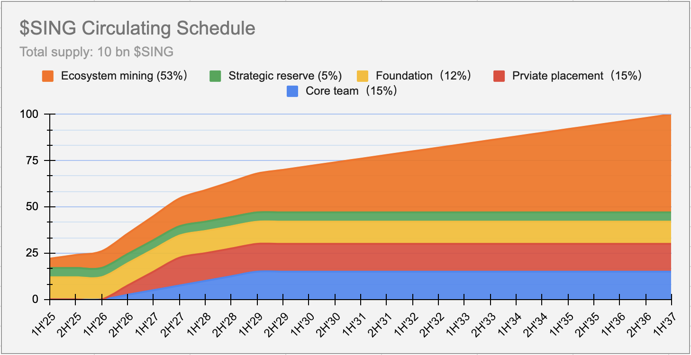
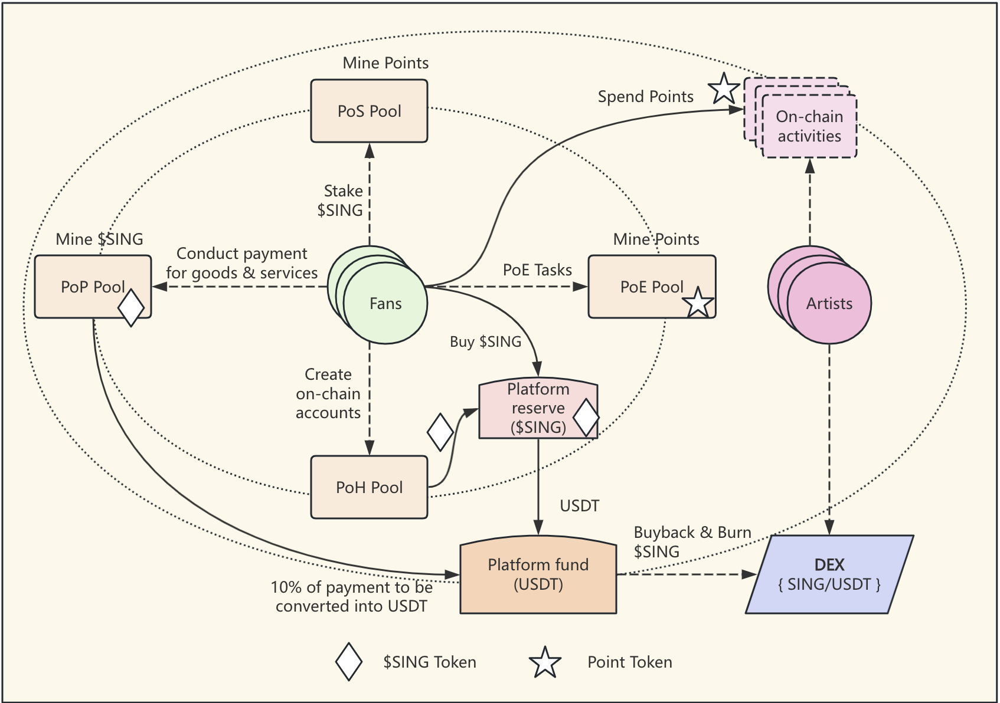

# SING Global: Web3 Music Ecosystem Application Platform

# 1. Vision

In the current music industry dominated by centralized platforms, the flow of value among artists, record labels, copyright holders, and fans is often restricted, leading to unfair revenue distribution, limited artist development, and insufficient fan engagement. SING Global’s core vision is to leverage blockchain technology to establish a fair, transparent, and decentralized Web3 music ecosystem. As the platform’s sole native music token, SING will closely collaborate with music institutions, companies, copyright holders, artists, and fans worldwide to collectively shape the future of music. Our goal is to empower all music participants who wish to utilize Web3 technology, enabling them to directly exchange value and interact, thereby breaking traditional barriers and reshaping the future of the music industry.

By deeply integrating the successful experiences of the traditional music industry with Web3 technology, SING Global will build a comprehensive ecosystem—from discovering emerging talents to creating “digital twin superstars” in the metaverse—ultimately achieving a transparent, fair, and decentralized music economy.

# 2. Industry Pain Points and Opportunities

There are significant structural gaps between Web2 and Web3 music platforms, highlighting the current pain points in the music industry. Web2 platforms (e.g., Spotify) excel in artist attribution and fan engagement but face growing issues with unfair revenue distribution and restricted artist development. In contrast, Web3 platforms emphasize autonomy and transparency but struggle with low fan retention, simplistic business models, and user retention rates below 30%. SING Global aims to overcome these challenges by creating a transparent and fair music economy ecosystem for artists, fans, institutions, and investors.

The global music industry is valued at over $200 billion, with digital music dominating the market. Web3 music platforms are experiencing explosive growth, reshaping value distribution models and gaining traction among Gen Z and millennial users, with nearly 80 such platforms worldwide. The Asian music market is expanding at an annual growth rate exceeding 15%, with its mature fan economy model gaining increasing global influence. SING Global will focus on the Asian market for vertical integration, seamlessly blending Web2 traditional models with Web3 innovations. The platform will offer artist incubation systems, fan investment platforms, smart contract management, and community governance mechanisms to ensure artists receive full lifecycle services, fans can become investors and managers, and institutions and investors gain corresponding returns.

# 3. Project Overview

SING is the native utility token of the SING Global decentralized music ecosystem. It serves as the core value carrier for payments, incentives, and governance. Through the SING token, we aim to establish a new music economy model where all participants can truly own digital assets and receive fair returns for their contributions. SING Global operates independently of any single platform, collaborating broadly with the global music ecosystem and supported by the high-performance FullOn Layer-1 blockchain. FullOn offers 100,000 TPS (transactions per second), low costs ($0.0002 GAS fees), and multi-chain compatibility (interoperable with Ethereum and Solana), providing robust technical support for SING Global.

# 4. Token Economic Model

## 4.1 Basic Information

- `Token Name`: SING
- `Total Supply`: 10 billion tokens

## 4.2 Token Allocation

- `Ecosystem Mining`: 53%
- `Core Team`: 15%
- `Private Sale`: 15%
- `Foundation`: 12%
- `Market Reserve`: 5%

The following chart illustrates the overall token allocation:

<h4 align="center" style="color:grey;font-weight: normal;">Chart-1: SING Token Allocation</h4>

## 4.3 SING Token Release Schedule

| Allocation Category | Percentage | Token Amount | Vesting Schedule | Description |
|---------------------|------------|---------------------|-----------------------------|------------------------------------------------|
| Core Team | 15% | 1.5B SING | 18-month lockup, 36-month linear release | Reserved for founding members, with vesting to ensure long-term alignment. |
| Private Sale | 15% | 1.5B SING | 18-month lockup, 18-month linear release | Allocated to early private investors, with vesting to prevent market dumping. |
| Foundation | 12% | 1.2B SING | None | Used for platform development, research, and community governance activities. |
| Strategic Reserve | 5% | 0.5B SING | None | Reserved for unforeseen opportunities and platform stabilization measures. |
| Ecosystem Mining | 53% | 5.3B SING | None | Mined through purchase, payment, and staking proofs to incentivize participation and ecosystem growth. |

## 4.4 SING Token Circulation Schedule

<h4 align="center" style="color:grey;font-weight: normal;">Chart-2: $SING Circulation Schedule</h4>

> [!TIP]
> `1H` = First half of the year, e.g., 1H'25 = First half of 2025
> `2H` = Second half of the year, e.g., 2H'25 = Second half of 2025

# 5. Token Utility

The SING token serves as the primary payment and value transfer tool within the ecosystem, with key utilities including:
- `Ecosystem Payments`: Used for purchasing music NFTs, virtual concert tickets, merchandise, etc.
- `Governance`: Token holders have voting rights on future ecosystem proposals, including DAO governance.
- `Incentives`: Rewards for artist creation, fan engagement, and node validation.

The SING economic model emphasizes “real revenue + asset backing + deflationary mechanisms.” Proof of Purchase (POP) is the primary mining model, with 50% of transaction fees used for buyback and burn, and 10% of platform revenue continuously allocated for buyback and burn to ensure stable value growth and avoid speculative volatility. Additionally, the widely used CISUM points token within the ecosystem is generated through a Proof of Stake (POS) mechanism.

The following high-level chart illustrates the interaction process among artists, fans, and the platform, showcasing various mining mechanisms:

<h4 align="center" style="color:grey;font-weight: normal;">Chart-3: $SING Ecosystem Architecture</h4>

> [!NOTE]
> 1. As the platform expands to global markets, any number of artist communities can be established.
> 2. Each artist community must contribute 10% of its platform revenue to the `platform reserve`.
> 3. The platform uses the `platform reserve` to buy back and burn $SING tokens, creating a continuous deflationary effect.

## 5.1 Proof of Purchase (POP)

POP is a unique token acquisition mechanism designed to integrate real-world consumption with blockchain economics. Its operation is as follows:
- When users purchase tickets, merchandise, digital albums, etc., through fiat (e.g., USD or stablecoins) within the ecosystem or partner channels, the system automatically extracts 10% of the payment amount.
- This 10% is returned to the paying user in an equivalent amount of SING tokens based on the current token price.
- Simultaneously, this 10% fiat amount is injected into the SING token’s Automated Market Maker (AMM) liquidity pool to enhance token liquidity and price stability.

This mechanism not only incentivizes users but also introduces continuous external capital inflow to ensure healthy liquidity. POP is the primary ecosystem mining model, supporting Real World Assets (RWA) such as IP RWA, artist performance RWA, copyright RWA, and artist growth RWA.

## 5.2 Proof of Stake (POS)

Users can stake SING tokens to earn on-chain points, a reward mechanism based on staking. On-chain points have the following features:
- SING Global provides platform, token, and Web3 technical support, while specific point names and rules are determined by partners.
- Points are non-tradable and used solely for ecosystem interactions to enhance user engagement and community activity.

# 6. Core Competitiveness

SING Global’s core competitiveness lies in the following areas: a focus on the full lifecycle RWA model for artists, the technical advantages of the FullOn blockchain, an innovative token economic model, and a top-tier industry leadership team.

## 6.1 Full Lifecycle RWA Model

SING Global operates a comprehensive artist incubation process across four stages—artist discovery, artist nurturing and promotion, artist achievement and commercialization, and ultimately creating “digital twin superstars.” This model fully manages artist growth RWA, artist copyright issuance RWA, artist performance RWA, and artist IP RWA, meeting fans’ emotional needs while enabling them to become investors and participants in artist management through RWA.

## 6.2 FullOn Blockchain - Technical Assurance

SING Global is built on the FullOn blockchain, designed specifically for Web3 and AI ecosystems, with the following technical advantages:
- `High Performance`: 100,000 TPS (transactions per second).
- `Fast Confirmation`: Transaction confirmation in less than 1 second.
- `Low Cost`: GAS fees of only $0.0002.
- `Multi-Chain Compatibility`: Interoperable with mainstream blockchains like Ethereum and Solana.
- `Secure and Reliable`: Utilizes an improved POS consensus mechanism, ensuring 99.99% availability.

## 6.3 Top Industry Leadership Team

SING Global brings together leaders from the Web2 music industry and blockchain experts, ensuring dual strengths in industry experience and technical expertise:
- Xiaofeng Xu: Former President of Warner Music China, a leading figure in Chinese music with experience managing over 30 superstar artists and 50M+ fans.
- Jun Kang: Former CEO of SM Entertainment, a pioneer in K-pop, successfully creating over 10 K-pop superstars with 50M+ fans.
- Thor: Founder of FullOn blockchain, former Senior Vice President at Morgan Stanley, and a blockchain architect with 8 years of public chain development experience.

# 7. Partnerships and Ecosystem Building

SING Global plans to establish deep partnerships with music institutions, companies, copyright holders, independent artists, and fan communities worldwide that are committed to exploring Web3 technology. Specific collaboration areas include:
- `Artist Collaboration`: Providing tools and technical support to help artists issue music NFTs, manage fan communities, and directly monetize their work.
- `Company Collaboration`: Partnering with music platforms and companies to explore Web3 solutions, bringing their IP into the blockchain world and enabling RWA for future revenue streams.
- `Developer Community`: Establishing a foundation to support third-party developers in building decentralized applications (DApps) based on the SING protocol, enriching the ecosystem.
- `Fan Participation`: Enabling fans to fulfill emotional value while investing in artist growth RWA, sharing in the profits of the artist’s journey, and participating in artist management.

# 8. Conclusion

SING Global aims to build a fairer, more transparent, and inclusive music world. Through the unique design of the SING token, we hope to redefine the value of music, ensuring all participants benefit. We look forward to collaborating with the global music ecosystem to create the next era of the music industry.